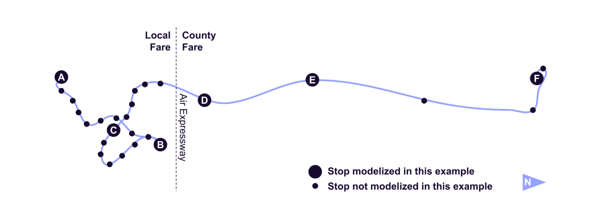

# Arrêts continus## Prise en charge et retour partout 
 
 L’agence de transport The Current (Rockingham, US-VT) applique une politique d’arrêt continu sur les itinéraires 2, 53 et 55. Un passager peut être sélectionné monter et descendre entre les arrêts prévus tout au long du parcours, à condition qu’il y ait un endroit sûr où le bus peut s’arrêter. 
 
 Le fichier [routes.txt](../../reference/#routestxt) permet de décrire ce service à l’aide des champs `continuous_pickup` et `continuous_drop_off`. Les champs sont définis sur « 0 » pour indiquer que les ramassages et dépôts continus sont autorisés. 
 
 [** routes.txt**](../../reference/#routestxt) 
 
 ``` 
 route_id,route_short_name,route_long_name,route_type,continuous_pickup,continuous_drop_off 
 2,2,Bellows Falls en ville,3,0,0 
 53,53,Bellows Falls/Battleboro Commuter,3,0,0 
 55,55,Bellows Falls/Springfield Shuttle,3,0,0 
 `` ` 

<hr> 
 
## Prise en charge et retour sur une section de l’itinéraire 
 
 L’agence de transport en commun Victor Valley Transit (Victorville, US-CA) applique une politique d’arrêt continu uniquement sur une partie de l’itinéraire 22. Un usager peut Montez à bord et descendez du bus dans n’importe quel endroit sûr dans la zone tarifaire du comté uniquement. Les prises en charge et les retours continus ne sont pas possibles dans la zone tarif local. 
 
 La zone tarifaire locale et la zone tarifaire départementale sont séparées par l’Air Expressway, comme le montre la figure ci-dessous. L’arrêt prévu National Trails Highway- Air Expressway est situé légèrement au nord de cette limite. Pour être précis, l’agence de transport en commun peut ajouter un arrêt à l’intersection réelle de la ligne de bus avec la limite, à partir duquel la prise en charge et le débarquement continus sont disponibles. Cet arrêt peut rester imprévu. 
 
  
 
 Ceci est décrit à l’aide des fichiers [stop.txt](../../reference/#stopstxt) et [stop_times.txt](../../reference/#stop_timestxt) : 
 
 - Le premier fichier définit les arrêts le long du parcours- Le deuxième fichier définit la prise en charge et le retour en continu règles entre les arrêts. 
 
 [**stop.txt**](../../reference/#stopstxt) 
 
 ``` 
 stop_id,stop_name,stop_lat,stop_lon 
 A, Station de transfert de Victoriaville, 34.514356,-117.318323 
 B, Dante St &amp; Venus Ave, 34.564499,-117.287097 
 C, Centre de transport de Victorville, 34.538433,-117.294703 
 X, Limite tarifaire locale/comté, 34.566224,-117.318357 
 D, National Trails Highway- Air Expressway,34.567536,-117.319716 
 E,Bureau de poste d’Oro Grande,34.599292,-117.334452 
 F,Silver Lakes Market,34.744662,-117.335407 
 ``` 
 
 Dans [stop_times.txt](../../reference/#stop_timestxt), pour un trajet donné : 
 
 - Un enregistrement avec `continuous_pickup=0` indique que les ramassages continus sont autorisés depuis cet arrêt jusqu’à l’arrêt suivant- Un enregistrement avec `continuous_pickup=0` =1` indique que les ramassages continus sont interdits à partir de cet arrêt jusqu’à l’arrêt suivant 
 
 [** stop_times.txt**](../../reference/#stop_timestxt) 
 
 ``` 
 trip_id, stop_id, stop_sequence,departure_time,arrival_time,continuous_pickup,continuous_drop_off,timepoint 
 22NB9AM,A,1,09:00:00,09:00:00,1,1,1 
 22NB9AM,B,2,09 : 14:00,09:14:00,1,1,1 
 22NB9AM,C,3,09:21:00,09:21:00,1,1,1 
 22NB9AM,X,4,,, 0,0,0 
 22NB9AM,D,5,09:25:00,09:25:00,0,0,1 
 22NB9AM,E,6,09:31:00,09:31:00, 0,0,1 
 22NB9AM,F,7,09:46:00,09:46:00,0,0,1 
 ``` 
 
 La même logique s’applique pour le champ `continuous_drop_off` mais pour le cas de dépôts. 
 
 Dans l’exemple ci-dessus, les arrêts A, B, C ontcontinuous_pickup et `continuous_drop_off` définis sur `1`, ce qui interdit les ramassages et dépôts continus entre eux. Les arrêts `X`, `D`, `E` et `F` ont les champs `continuous_pickup` et `continuous_drop_off` définis sur `0`, ce qui permet des ramassages et des dépôts continus entre eux. 
 
 <sup>[Exemple de source](https://vvta.org/routes/route-22/)</sup>